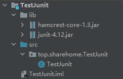
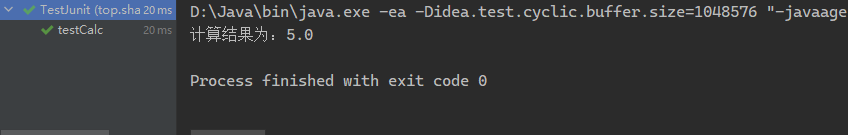
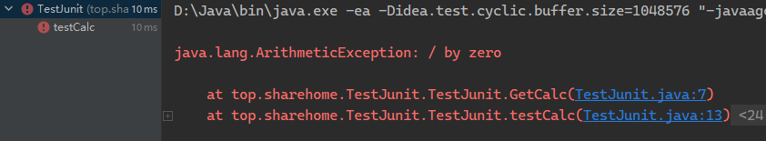
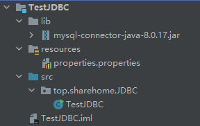
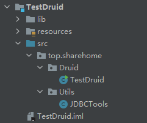
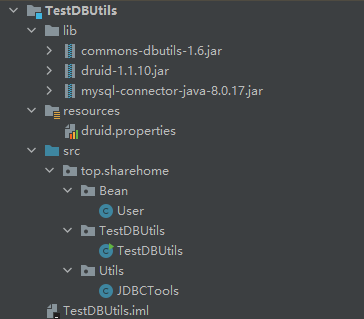
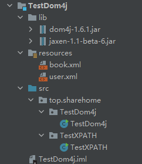
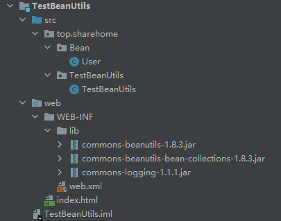
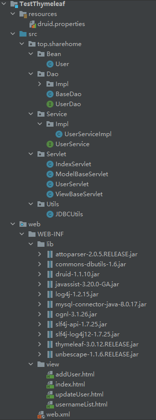
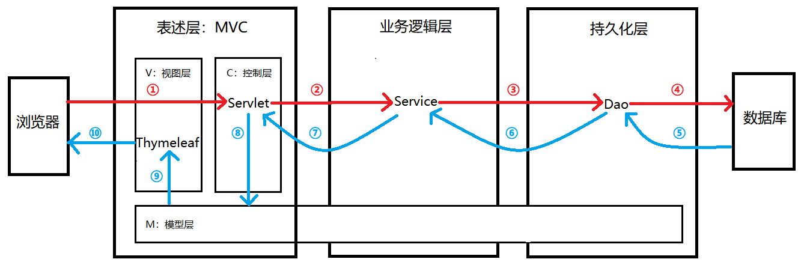

# 0.以下只是Jar包的基础功能，其他复杂功能按需学习

# 1.测试类Jar包

**jar包如下：**

 [hamcrest-core-1.3.jar](常用jar包\测试类jar包\hamcrest-core-1.3.jar) 

 [junit-4.12.jar](常用jar包\测试类jar包\junit-4.12.jar) 

## Jar包介绍

Junit 是 Java 语言编写的第三方单元测试框架，Java 中的单元就是一个类，即不需要使用 main 主函数就能够直接调用该类中的方法，达到测试功能和业务逻辑的目的；

**模块目录示例如下：**



## 使用Jar包

**注意点：**

- 被测试类的类名的命名规范：以Test开头，以业务类类名结尾，使用驼峰命名法；
  被测试类中测试方法命名规范：以test开头，以业务方法名结尾；
- 必须是public修饰的，没有返回值，没有参数；
- 必须使注解@Test修饰；
- 在 IDEA 中编程时，运行需要选中方法名，或者测试类类名，或者模块名右击运行；
- 测试结果：绿色表示测试通过，红色表示失败；
- 不能对其进行 Scanner 类获取操作；

**示例如下：**

**案例一：**设计一个加法运算器方法，并且使用 Junit 进行测试；

```java
package top.sharehome.TestJunit;

import org.junit.Test;

public class TestJunit {
    public double GetCalc(double one,double two) {
        double result = one + two;
        return result;
    }

    @Test
    public void testCalc() {
        double result = GetCalc(2,3);
        System.out.println("计算结果为：" + result);
    }
}
```

打印效果如下：



**案例二：**设计一个除法计算器方法，让其最终输出异常；

```java
package top.sharehome.TestJunit;

import org.junit.Test;

public class TestJunit {
    public double GetCalc(double one,double two) {
        double result = one/two;
        return result;
    }

    @Test
    public void testCalc() {
        double result = GetCalc(2,0);
        System.out.println("计算结果为：" + result);
    }
}
```

打印效果如下：



==注意：浮点运算中会出现无穷大（Infinity）和无穷小（NaN）结果，所以这里应该改为 Int 类型；==

# 2.JDBC类Jar包

**jar包如下：**

 [mysql-connector-java-5.0.8-bin.jar](常用jar包\JDBC类jar包\mysql-connector-java-5.0.8-bin.jar) 

 [mysql-connector-java-8.0.17.jar](常用jar包\JDBC类jar包\mysql-connector-java-8.0.17.jar) 

## Jar包介绍

上述两个 Jar 包需要依照 MySQL 版本而进行选择，版本号和 jar 包后面的版本号相同，该文档主要介绍 MySQL8 版本的 JDBC jar 包；

**模块目录示例如下：**



## 准备示例数据库

```mysql
create database jar_test;

use jar_test;

create table user(
	id int primary key auto_increment,
	username varchar(20),
	password varchar(20),
	nickname varchar(20)
);

INSERT INTO `USER` VALUES(null,'zs','123456','老张');
INSERT INTO `USER` VALUES(null,'ls','123456','老李');
INSERT INTO `USER` VALUES(null,'wangwu','123456','老王');
```

## 使用Jar包

==以下是基本步骤，需要依次完成；==

### properties配置文件

==假设文件为properties.properties==

**MySQL8：**

```properties
driverClassName=com.mysql.cj.jdbc.Driver
url=jdbc:mysql://localhost:3306/数据库名字?useSSL=false&serverTimezone=UTC&characterEncoding=UTF-8
username=root
password=123456
```

**MySQL5：**

```properties
driverClassName=com.mysql.jdbc.Driver
url=jdbc:mysql://localhost:3306/数据库名字?useSSL=false&characterEncoding=UTF-8
username=root
password=123456
```

### 读取properties文件

```java
Properties properties = new Properties();

//该properties对象需要加载我们的配置文件
//绝对路径加载方法：
properties.load(new FileInputStream("配置文件的绝对路径"));
//相对路径加载方法：
InputStream inputStream = 本类类名.class.getClassLoader().getResourceAsStream("properties.properties");

String driverClassName = properties.getProperty("driverClassName");
String url = properties.getProperty("url");
String username = properties.getProperty("username");
String password = properties.getProperty("password");
```

### 注册驱动

```java
Class.forName(driverClassName);
```

### 获取连接

```java
Connection connection = DriverManager.getConnection(url, username, password);
```

### 设置sql语句

```mysql
String query1 = "select * from user";
String update = "Update user set user.username = ww where user.username = wangwu";
String query2 = "select * from user where id = ?";
String delete = "delete from user where username = ?";
```

### 创建statement对象

```java
//创建普通的Statement对象
Statement statement = connection.createStatement();
//为了防止SQL注入问题，创建PreparedStatement预编译对象
PreparedStatement preparedStatement = connection.prepareStatement(SQL语句);
```

### 执行SQL语句

**Statement对象使用executeQuery和executeUpdate执行SQL语句：**

```java
//查操作
ResultSet resultSet = statement.executeQuery(query1);
//查询操作后得到一个Set集合，需要对其遍历
while (resultSet.next()){
    System.out.println(resultSet.getObject(1) + " " + resultSet.getObject(2) + " " + resultSet.getObject(3) + " " + resultSet.getObject(4));
}
//增删改操作
int i = statement.executeUpdate(update);
//增删改操作后得到此次操作所影响的行数
```

**PreparedStatement对象使用执行SQL语句：**

```java
PreparedStatement preparedStatement1 = connection.prepareStatement(query2);
//为第一个预编译SQL语句设置值
preparedStatement1.setString(1, "1");
PreparedStatement preparedStatement2 = connection.prepareStatement(delete);
//为第二个预编译SQL语句设置值
preparedStatement2.setString(1, "ww");

//执行第一个SQL语句
boolean execute1 = preparedStatement1.execute();
//因为该语句是查语句，所以返回true
if (execute1 == true) {
	ResultSet resultSet = preparedStatement1.getResultSet();
	while (resultSet.next()) {
	System.out.println(resultSet.getObject(1) + " " + resultSet.getObject(2) + " " + resultSet.getObject(3) + " " + resultSet.getObject(4));
	}
}
//执行第二个SQL语句
boolean execute2 = preparedStatement2.execute();
//因为该语句是增删查语句，所以返回false
if (execute2 == false) {
	int updateCount = preparedStatement2.getUpdateCount();
	System.out.println("已经影响了" + updateCount+"行");
}
```

### 关闭相关资源

```java
//一个节省资源的操作，即判断关闭
if (connection != null) {
    connection.close();
}
if (preparedStatement1 != null) {
    preparedStatement1.close();
}
if (preparedStatement2 != null) {
    preparedStatement2.close();
}
if (inputStream!=null){
    inputStream.close();
}
......
```

# 3.连接池类jar包

**jar包如下：**

 [druid-1.1.10.jar](常用jar包\连接池类jar包\druid-1.1.10.jar) 

## Jar包介绍

Druid 是阿里提供的数据库连接池，据说是集DBCP 、C3P0 、Proxool 优点于一身的数据库连接池；而该连接池被集成在了这个 jar 包内；

**模块目录示例如下：**



## 准备示例数据库

```mysql
create database jar_test;

use jar_test;

create table user(
	id int primary key auto_increment,
	username varchar(20),
	password varchar(20),
	nickname varchar(20)
);

INSERT INTO `USER` VALUES(null,'zs','123456','老张');
INSERT INTO `USER` VALUES(null,'ls','123456','老李');
INSERT INTO `USER` VALUES(null,'wangwu','123456','老王');
```

## 使用Jar包

### Properties配置文件

==假设文件为druid.properties==

**MySQL8：**

```properties
driverClassName=com.mysql.cj.jdbc.Driver
url=jdbc:mysql://localhost:3306/数据库名字?useSSL=false&serverTimezone=UTC&characterEncoding=UTF-8
username=root
password=123456
initialSize=5
maxActive=10
maxWait=1000
```

**MySQL5：**

```properties
driverClassName=com.mysql.jdbc.Driver
url=jdbc:mysql://localhost:3306/数据库名字?useSSL=false&characterEncoding=UTF-8
username=root
password=123456
initialSize=5
maxActive=10
maxWait=1000
```

### 读取properties文件

==和JDBC类Jar包读取方式一样==

```java
Properties properties = new Properties();
InputStream inputStream = TestDruid.class.getClassLoader().getResourceAsStream("druid.properties");
properties.load(inputStream);
```

### 创建Druid的DataSource对象

```java
DataSource dataSource = DruidDataSourceFactory.createDataSource(properties);
```

### 使用连接池对象获取连接

```java
Connection connection = dataSource.getConnection();
```

## 实际使用(JDBCUtils类)

当需要运用到 JDBC 和连接池时，我们可以设计一个 JDBCTools 封装工具类；

```
package top.sharehome.Druid.utils;

import com.alibaba.druid.pool.DruidDataSourceFactory;

import javax.sql.DataSource;
import java.io.InputStream;
import java.sql.Connection;
import java.sql.SQLException;
import java.util.Properties;

public class JDBCTools {
    private static DataSource dataSource;
    static {
        try {
            //1. 使用类加载器读取配置文件，转成字节输入流
            InputStream is = JDBCTools.class.getClassLoader().getResourceAsStream("druid.properties");
            //2. 使用Properties对象加载字节输入流
            Properties properties = new Properties();
            properties.load(is);
            //3. 使用DruidDataSourceFactory创建连接池对象
            dataSource = DruidDataSourceFactory.createDataSource(properties);
        } catch (Exception e) {
            e.printStackTrace();
        }
    }

    /**
     * 获取连接池对象
     * @return
     */
    public static DataSource getDataSource(){

        return dataSource;
    }

    /**
     * 获取连接
     * @return
     */
    public static Connection getConnection() {
        try {
            return dataSource.getConnection();
        } catch (SQLException e) {
            e.printStackTrace();
            throw new RuntimeException(e.getMessage());
        }
    }

    /**
     * 释放连接
     * @param connection
     */
    public static void releaseConnection(Connection connection){
        try {
            connection.close();
        } catch (SQLException e) {
            e.printStackTrace();
            throw new RuntimeException(e.getMessage());
        }
    }
}
```

### 实际使用总结

1. 拷贝加入druid的jar包；
2. 拷贝druid的properties配置文件到类路径，并修改；
3. 拷贝JDBCTools工具类
4. 在需要连接的地方编写`Connection conn = JDBCTools.getConnection();`此时拿到的连接就是从连接池拿的
5. 连接使用完毕之后，调用`JDBCTools.releaseConnection(conn);`归还连接

# 4.DBUtils JDBC工具类Jar包

**jar包如下：**

 [commons-dbutils-1.6.jar](常用jar包\DBUtils JDBC工具类Jar包\commons-dbutils-1.6.jar) 

## Jar包介绍

commons-dbutils 是 Apache 组织提供的一个开源 JDBC工具类库，它是对JDBC的简单封装，学习成本极低，并且使用dbutils能极大简化jdbc编码的工作量，同时也不会影响程序的性能。

其中QueryRunner类封装了SQL的执行，是线程安全的。

（1）可以实现增、删、改、查、批处理、

（2）考虑了事务处理需要共用Connection。

（3）该类最主要的就是简单化了SQL查询，它与ResultSetHandler组合在一起使用可以完成大部分的数据库操作，能够大大减少编码量。

**模块目录示例如下：**



## 准备示例数据库

```mysql
create database jar_test;

use jar_test;

create table user(
	id int primary key auto_increment,
	username varchar(20),
	password varchar(20),
	nickname varchar(20)
);

INSERT INTO `USER` VALUES(null,'zs','123456','老张');
INSERT INTO `USER` VALUES(null,'ls','123456','老李');
INSERT INTO `USER` VALUES(null,'wangwu','123456','老王');
```

## 使用Jar包

==使用这个Jar包，通常需要把**连接池类jar包**中实际使用总结部分先完成，**以下是完成以上准备后的操作；**==

### 使用DBUtils执行增删改任务

**增加数据方法：**

```java
public static void TestAdd() throws SQLException {
    //创建queryRunner对象
    QueryRunner queryRunner = new QueryRunner();

    //String sql = "insert into user values(null,'aaa','111','露西')";
    String sql = "insert into user values(?,?,?,?)";

    Object[] params = {null, "aaa", "111", "露西"};
    queryRunner.update(JDBCTools.getConnection(), sql, params);
}
```

**删除数据方法：**

```java
public static void TestDelete() throws SQLException {
        QueryRunner queryRunner = new QueryRunner();
        String sql = "delete from user where username = ?";
        queryRunner.update(JDBCTools.getConnection(),sql,"aaa");
    }
```

**修改数据方法：**

```java
public static void TestChange() throws SQLException {
    QueryRunner queryRunner = new QueryRunner();
    String sql = "update user set username = ? where username = ?";
    Object[] params = {"ww","wangwu"};
    queryRunner.update(JDBCTools.getConnection(),sql,params);
}
```

### 使用DBUtils执行批处理任务

```java
public static void TestBatch() throws SQLException {
    QueryRunner queryRunner = new QueryRunner();
    Object[][] objects = new Object[20][3];
    String sql = "insert into user values(null,?,?,?)";
    for (int i = 0; i < objects.length; i++) {
        Object[] insertObjects = new Object[3];
        insertObjects[0] = "test"+i;
        insertObjects[1] = "123456";
        insertObjects[2] = "nickname"+i;
        objects[i] = insertObjects;
    }
    queryRunner.batch(JDBCTools.getConnection(),sql,objects);
}
```

### 使用DBUtils执行查询语句

```java
public static void TestQuery() throws SQLException {
    QueryRunner queryRunner = new QueryRunner(JDBCTools.getDataSource());
    //查询单个记录用BeanHandler<>(User.class)
    User query = queryRunner.query("select * from user", new BeanHandler<>(User.class));
    System.out.println(query.toString());
    System.out.println("++++++++++++++++++++++++++++++++++++++++++++++++++++++++++++++++++++++++");
    //查询多个记录用BeanListHandler<>(User.class)
    List<User> query1 = queryRunner.query("select * from user", new BeanListHandler<>(User.class));
    query1.forEach(c-> System.out.println(c));
}
```

# 5.XML解析jar包

**jar包如下：**

 [dom4j-1.6.1.jar](常用jar包\XML解析jar包\dom4j-1.6.1.jar) （dom4j）

 [jaxen-1.1-beta-6.jar](常用jar包\XML解析jar包\jaxen-1.1-beta-6.jar) （XPATH）

## Jar包介绍

在使用Java代码解析XML的时候，我们通常不会直接使用JDK内置的原生的DOM或者SAX解析XML，因为代码实在是太复杂了。一些公司和组织已经封装好了优秀的XML解析器，我们通常会使用第三方XML解析器来解析XML；

dom4j包是一个xml解析器，XPATH包是一个使用规则匹配直接查找xml文件中的指定节点；

**模块目录示例如下：**



## 准备XML示例文件

**book.xml:**

```java
<?xml version="1.0" encoding="UTF-8"?>
<books>
    <book id="1">
        <name>西游记</name>
        <author>吴承恩</author>
        <price>100.0元</price>
    </book>
    <book id="2">
        <name>红楼梦</name>
        <author>曹雪芹</author>
        <price>200.0元</price>
    </book>
    <book id="3">
        <name>聊斋志异</name>
        <author>蒲松龄</author>
        <price>300.0元</price>
    </book>
    <book id="4">
        <name>三国演义</name>
        <author>罗贯中</author>
        <price>400.0元</price>
    </book>
    <paper id="5">
        <date>2022年1月23日</date>
        <news>事件一</news>
    </paper>
    <paper id="6">
        <date>2022年4月23日</date>
        <news>事件二</news>
    </paper>
</books>
```

**user.xml：**

```java
<?xml version="1.0" encoding="UTF-8"?>
<person>
    <student id="1">
        <name>xiaochen</name>
        <age>18</age>
        <address>shanghai</address>
    </student>
    <student id="2">
        <name>xiaowu</name>
        <age>20</age>
        <address>sichuan</address>
        <info message="hello"/>
    </student>
</person>
```

## 使用Jar包

### dom4j包示例

```java
package top.sharehome.TestDom4j;

import org.dom4j.Document;
import org.dom4j.DocumentException;
import org.dom4j.Element;
import org.dom4j.io.SAXReader;

import java.io.InputStream;
import java.util.List;

public class TestDom4j {
    public static void main(String[] args) throws DocumentException {
        //首先将xml文件转换成流
        InputStream book = TestDom4j.class.getClassLoader().getResourceAsStream("book.xml");
        //创建SAXReader对象
        SAXReader saxReader = new SAXReader();
        //让SAXReader对象去解析流文件，得到一颗Dom树，即Document对象
        Document bookDom = saxReader.read(book);
        //操作树的第一步就是获取跟标签
        Element bookElement = bookDom.getRootElement();
        //Element标签对象的elements()可以拿到其子标签集合，可以迭代获取
        //Element标签对象的getText()可以拿到标签体内的文本
        List<Element> bookElements = bookElement.elements();
        for (Element element : bookElements) {
            List<Element> sonElement = element.elements();
            for (Element element1 : sonElement) {
                System.out.println(element1.getText());
            }
        }
    }
}
```

### XPATH包示例

```java
package top.sharehome.TestXPATH;

import org.dom4j.Document;
import org.dom4j.DocumentException;
import org.dom4j.io.SAXReader;

import java.io.InputStream;

public class TestXPATH {
    public static void main(String[] args) throws DocumentException {
        //首先需要把xml文件转换成流
        InputStream resourceAsStream = TestXPATH.class.getClassLoader().getResourceAsStream("user.xml");
        //再用SAXReader对象解析流
        SAXReader saxReader = new SAXReader();
        //随后调用SAXReader对象的read()方法获取到xml文件中的Dom树，即Document对象
        Document dom = saxReader.read(resourceAsStream);
        //直接调用Document对象的selectSingleNode()和selectNodes()规则获取标签内容
        dom.selectSingleNode("路径规则");
        dom.selectNodes("路径规则");
        //注意：相关的路径标签写法需要上网检索
    }
}
```

# 6.BeanUtils 将客户端请求封装成JavaBean

**jar包如下：**

 [commons-beanutils-1.8.3.jar](常用jar包\BeanUtils 将客户端请求封装成JavaBean\commons-beanutils-1.8.3.jar) 

 [commons-beanutils-bean-collections-1.8.3.jar](常用jar包\BeanUtils 将客户端请求封装成JavaBean\commons-beanutils-bean-collections-1.8.3.jar) 

 [commons-logging-1.1.1.jar](常用jar包\BeanUtils 将客户端请求封装成JavaBean\commons-logging-1.1.1.jar) 

## Jar包介绍

在 JavaEE 中，服务端接收客户端的 request 数据，将其中的数据通过键值对的方式获取到，并且封装在一个 Map 中，而想要客户端的数据和数据库中的数据进行交互，需要将其封装在一个 JavaBean 中，然后通过流将 JavaBean 中的数据转换成 JDBC 所认识的数据；

而这个包的作用就是将 Map 中的数据转换成 JavaBean 中的数据；

**模块目录示例如下：**



## 准备前端文件

```html
<!DOCTYPE html>
<html lang="en">
<head>
    <meta charset="UTF-8">
    <title>Title</title>
</head>
<body>
<form action="/TestBeanUtils/BeanUtils" method="get">
    用户名：<input type="text" name="username"><br>
    密码：<input type="password" name="password"><br>
    <input type="submit">
</form>
</body>
</html>
```

## 准备JavaBean类

```java
package top.sharehome.Bean;

public class User {
    private String username;
    private String password;

    @Override
    public String toString() {
        return "User{" +
                "username='" + username + '\'' +
                ", password='" + password + '\'' +
                '}';
    }

    public String getUsername() {
        return username;
    }

    public void setUsername(String username) {
        this.username = username;
    }

    public String getPassword() {
        return password;
    }

    public void setPassword(String password) {
        this.password = password;
    }
}
```

## 使用Jar包

```java
package top.sharehome.TestBeanUtils;

import org.apache.commons.beanutils.BeanUtils;
import top.sharehome.Bean.User;

import javax.servlet.ServletException;
import javax.servlet.http.HttpServlet;
import javax.servlet.http.HttpServletRequest;
import javax.servlet.http.HttpServletResponse;
import java.io.IOException;
import java.lang.reflect.InvocationTargetException;
import java.util.Map;

public class TestBeanUtils extends HttpServlet {
    @Override
    protected void doGet(HttpServletRequest request, HttpServletResponse response) throws ServletException, IOException {
        doPost(request, response);
    }

    @Override
    protected void doPost(HttpServletRequest request, HttpServletResponse response) throws IOException {
        //将客户端传来的数据转换成我们想要的字符集
        request.setCharacterEncoding("utf-8");
        //创建一个JavaBean对象
        User user = new User();
        //由请求getParameterMap()方法将请求中的数据存在map中
        Map<String, String[]> parameterMap = request.getParameterMap();
        try {
            //使用BeanUtils包中的populate静态方法将Map数据转换成JavaBean数据
            BeanUtils.populate(user,parameterMap);
        } catch (IllegalAccessException e) {
            throw new RuntimeException(e);
        } catch (InvocationTargetException e) {
            throw new RuntimeException(e);
        }
        System.out.println(user);
    }
}
```

# 7.IOUtils输入输出流Jar包

**jar包如下：**

 [commons-io-1.4.jar](常用jar包\IOUtils 输入输出流Jar包\commons-io-1.4.jar) 

## Jar包介绍

该类的所有成员函数都被用来处理输入 - 输出流，它的确非常利于来编写处理此类事务的程序。`IOUtils`与其他Apache Commons中的类一样，都是处理IO操作的非常重要包装器，与手动编写这些功能的其他程序相比，它们实现这些方法的代码变得更小，更清晰，更易理解。

现在我们将要讨论的是IOUtils中的一些非常重要的方法。类中的所有处理InputStream的方法都带有内部的缓冲区，所以我们不需要再使用 BufferedReader或者 BufferedInputStream，默认的缓冲区大小为4K，不过我们也可以自定义它的大小。

**重要方法：**

- **static void closeQuietly(Closeable closeable)**：它将无条件的关闭一个可被关闭的对象而不抛出任何异常。它也有很多版本去支持关闭所有的InputStream、OutputStream、Reader和Writer。
- **static boolean contentEquals(Reader inp1,Reader inp2)**：这个方法将比较两个Reader对象的内容是否相同，相同返回true，否则返回false。它还有另外的一个版本去比较InputStream对象。还有一个方法 contentEqualsIgnoreEOL(Reader r1,Rrader r2)，它将忽略行结束符而比较内容。
- ==**static int copy(InputStream inp,OutputStream outp)**==：这个方法将内容按字节从一个InputStream对象复制到一个OutputStream对象，并返回复制的字节数。同样有一个方法支持从Reader对象复制到Writer对象。
- **static LineIterator lineIterator(InputStream input,String enc)**：这个方法将从InputStream中返回一个行迭代器，我们可以指定一个字符格式（或者为空而使用默认的）。行迭代器将持有一个打开的InputStream的引用。当你迭代结束后，应当关闭stream来释放内部资源。这个字符编码也可以是一个字符集对象。同样也有一个方法支持Reader对象。

## 使用Jar包

```java
package top.sharehome.TestIOUtils;

import org.apache.commons.io.IOUtils;
import org.apache.commons.io.LineIterator;

import java.io.*;

public class TestIOUtils {
    public static void main(String[] args) throws IOException {
        InputStream pic1 = TestIOUtils.class.getClassLoader().getResourceAsStream("1.jpg");
        InputStream pic2 = TestIOUtils.class.getClassLoader().getResourceAsStream("2.jpg");
        InputStream v3 = TestIOUtils.class.getClassLoader().getResourceAsStream("2.mp4");
        InputStream txt = TestIOUtils.class.getClassLoader().getResourceAsStream("3.txt");
        File file = new File("D:\\大学课程学习文档\\java\\JarTest\\TestIOUtils\\resources\\"+Math.random()+".mp4");
        OutputStream outputStream = new FileOutputStream(file);
        //比较两个流是否一样
        boolean a = IOUtils.contentEquals(pic1, pic2);
        boolean b = IOUtils.contentEquals(pic1, v3);
        System.out.println("1.jpg和2.jpg的流比较："+a);
        System.out.println("1.jpg和2.mp4的流比较："+b);
        //读取流中的内容
        LineIterator utf8 = IOUtils.lineIterator(txt, "utf8");
        while (utf8.hasNext()){
            System.out.println(utf8.nextLine());
        }
        //拷贝文件
        int copy = IOUtils.copy(v3, outputStream);
        System.out.println(copy);
        //关闭流资源
        IOUtils.closeQuietly(pic1);
        IOUtils.closeQuietly(pic2);
        IOUtils.closeQuietly(v3);
        IOUtils.closeQuietly(txt);
        IOUtils.closeQuietly(outputStream);
    }
}
```

# 8.MD5加密类

## 加密类介绍

MD5加密是一种不可解密的加密方法，通常用于验证字符串的真实性，即两个数据加密后，密文相同，即两个数据相同；

## 加密类使用

```java
public class MD5Util {

    /**
     * 针对明文字符串执行MD5加密
     * @param source
     * @return
     */
    public static String encode(String source) {

        // 1.判断明文字符串是否有效
        if (source == null || "".equals(source)) {
            throw new RuntimeException("用于加密的明文不可为空");
        }

        // 2.声明算法名称
        String algorithm = "md5";

        // 3.获取MessageDigest对象
        MessageDigest messageDigest = null;
        try {
            messageDigest = MessageDigest.getInstance(algorithm);
        } catch (NoSuchAlgorithmException e) {
            e.printStackTrace();
        }

        // 4.获取明文字符串对应的字节数组
        byte[] input = source.getBytes();

        // 5.执行加密
        byte[] output = messageDigest.digest(input);

        // 6.创建BigInteger对象
        int signum = 1;
        BigInteger bigInteger = new BigInteger(signum, output);

        // 7.按照16进制将bigInteger的值转换为字符串
        int radix = 16;
        String encoded = bigInteger.toString(radix).toUpperCase();

        return encoded;
    }
}
```

==该类中只有一个 encode 方法，该方法只需要传入想要加密的内容，就能返回一个加密后的密文；==

# 9.thymeleaf Jar包

**jar包如下：**

 [attoparser-2.0.5.RELEASE.jar](常用jar包\thymeleaf jar包\lib\attoparser-2.0.5.RELEASE.jar) 

 [javassist-3.20.0-GA.jar](常用jar包\thymeleaf jar包\lib\javassist-3.20.0-GA.jar) 

 [log4j-1.2.15.jar](常用jar包\thymeleaf jar包\lib\log4j-1.2.15.jar) 

 [ognl-3.1.26.jar](常用jar包\thymeleaf jar包\lib\ognl-3.1.26.jar) 

 [slf4j-api-1.7.25.jar](常用jar包\thymeleaf jar包\lib\slf4j-api-1.7.25.jar) 

 [slf4j-log4j12-1.7.25.jar](常用jar包\thymeleaf jar包\lib\slf4j-log4j12-1.7.25.jar) 

 [thymeleaf-3.0.12.RELEASE.jar](常用jar包\thymeleaf jar包\lib\thymeleaf-3.0.12.RELEASE.jar) 

 [unbescape-1.1.6.RELEASE.jar](常用jar包\thymeleaf jar包\lib\unbescape-1.1.6.RELEASE.jar) 

## Jar包介绍

Thymeleaf是一款用于渲染XML/XHTML/HTML5内容的模板引擎。类似JSP，Velocity，FreeMaker等， 它也可以轻易的与Spring MVC等Web框架进行集成作为Web应用的模板引擎。它的主要作用是在静态页面上渲染显示动态数据；

==该包的具体内容在**Web技术**中有提到，这里主要讲解使用该包时的项目结构以及具体和三层结构相结合的示例；==

**模块目录示例如下：**



## 准备示例数据库

```mysql
create database jar_test;

use jar_test;

create table user(
	username varchar(20)
);
```

## 使用Jar包

### MVC概念

M：Model模型

V：View视图

C：Controller控制器

MVC是在表述层开发中运用的一种设计理念。主张把**封装数据的『模型』**、**显示用户界面的『视图』**、**协调调度的『控制器』**分开。

**好处：**

- 进一步实现各个组件之间的解耦
- 让各个组件可以单独维护
- 将视图分离出来以后，我们后端工程师和前端工程师的对接更方便

### MVC和三层架构之间关系（重点）



1. 浏览器发起表单请求，表述层首先得创建一个业务逻辑层中类的对象，请求被表述层中的 Servlet 对象给接收，即 request.getParameterMap() 或者 request.getParameter() 方法获取；

   - 如果是前者方法获取，多数情况下需要调用 BeanUtils.populate() 方法将得到的表单信息 List 封装成一个 JavaBean 对象，再将这个对象传给业务逻辑层，即通过业务逻辑层的对象调用业务逻辑层中的方法；
   - 如果是后者方法获取，多数情况下是直接将获取到的参数传给业务逻辑层，即通过业务逻辑层的对象调用业务逻辑层中的方法；

2. 业务逻辑层首先得创建一个持久层中类的对象，随后接收到 Servlet 传送过来的参数，可以对传送来的参数进行预处理（也可以不进行预处理，这完全取决于持久层中的方法所需要的参数要求），然后将处理后（无需处理）的参数传给持久层，即通过持久层的对象调用持久层中的方法；

3. 持久层主要内容就是 SQL 语句的执行，持久层接收到来自业务逻辑层的参数，随后依靠 DBUtils jar 包中的方法对参数和事先写好的 SQL 语句进行处理，通常不会直接调用 DBUtils 中的方法，而是先对 DBUtils 进行二次封装，封装所达到的效果就是能够直接实现增删改查，此处具体事项见 ==**4.DBUtils JDBC工具类Jar包**== 的描述；

4. 此处的数据库指的是具有能够操作数据库功能的 Java 方法，具体指的就是 ==**4.DBUtils JDBC工具类Jar包**== 中的内容；按照写代码的逻辑，通常会要求数据库返回一个项目中所涉及的到的 JavaBean 对象或者 JavaBean List 对象（很少出现其他类型的数据，这完全取决于项目代码的需求，所以以下描述均以 JavaBean 对象或者 JavaBean List 对象做描述）或者不回传参数（该情况通常指仅需要修改数据库中的数据，且这些数据不需要进行展示），以下**第5点和第6点只探讨会回传参数的情况，不回传参数视为功能已经完成，进程结束**；

5. 持久层接收到数据库所传来的 JavaBean 对象或者 JavaBean List 对象后，将该对象传回业务逻辑层；

6. 业务逻辑层接收到持久层所传来的 JavaBean 对象或者 JavaBean List 对象后，将该对象传回表述层；

7. 若没有参数回传，则表述层通常会采用重定向 response.sendRedirect() 或者请求转发 request.getRequestDispatcher().forward(request,response) 的方式跳转到目标页面，此时将图中的第7，8，9步视为一步；
   若有参数回传，则先获取到业务逻辑层所传来的 JavaBean 对象或者 JavaBean List 对象，然后传送给模型层，模型层在整个 Java 代码中均能共用，随后和没有参数回传情况一样，表述层通常会采用重定向 response.sendRedirect() 或者请求转发 request.getRequestDispatcher().forward(request,response) 的方式跳转到目标页面，而目标页面此时无展示数据，需要等到第8点和第9点的执行；

8. 模型层拿到的对象一般指 Servlet 中的域对象，即：

   ```java
   String requestAttrName = "helloRequestAttr";
   String requestAttrValue = "helloRequestAttr-VALUE";
   //请求域
   request.setAttribute(requestAttrName, requestAttrValue);
   //会话域
   HttpSession session = request.getSession();
   session.setAttribute("helloSessionAttr", "helloSessionAttr-VALUE");
   //操作应用域
   ServletContext servletContext = getServletContext();
   servletContext.setAttribute("helloAppAttr", "helloAppAttr-VALUE");
   ```

   以上代码展示了如何存储数据到模型层，随后的视图层中通过 Thymeleaf 取出模型层数据；

9. 视图层中的 Thymeleaf 获取模型层中的数据，获取示例如下：

   ```html
   <!--获取请求域数据-->
   <p th:text="${helloRequestAttr}">这里显示请求域</p>
   <!--获取会话域数据-->
   <p th:text="${session.helloSessionAttr}">这里显示会话域数据</p>
   <!--获取操作应用域数据-->
   <p th:text="${application.helloAppAttr}">这里显示操作应用域数据</p>
   ```

   获取后将数据传送至浏览器；

10. 浏览器最终结合第9点传来的数据和第7点中的目标页面展示最终页面；

### 常用Thymeleaf语法示例

==具体请查看**Web技术**==

```html
<html lang="en" xmlns:th="http://www.thymeleaf.org"></html>

<a th:href="@{/username(method='showAll')}">跳转到用户名表</a>

<tbody th:if="${#lists.isEmpty(users)}"></tbody>

<tbody th:unless="${#lists.isEmpty(users)}"></tbody>

<tr th:each="user,status:${users}"></tr>

<td th:text="${user.username}">用户名</td>

<input type="hidden" th:value="${oldName}" name="oldName">

<form th:action="@{/username(method='add')}" method="post"></form>
```

# 10.验证码图片Jar包

**jar包如下：**

 [kaptcha-2.3.2.jar](常用jar包\验证码图片jar包\WEB-INF\lib\kaptcha-2.3.2.jar) 

## Jar包介绍

kaptcha jar包可以看成一个已经写好的Servelt，即可以直接与网页所交互的一个类文件，它能够自动生成验证码图片和校验验证码；

## 配置web.xml文件

导入jar包后第一步就应该配置相对应的web.xml文件

```xml
<?xml version="1.0" encoding="UTF-8"?>
<web-app xmlns="http://xmlns.jcp.org/xml/ns/javaee"
         xmlns:xsi="http://www.w3.org/2001/XMLSchema-instance"
         xsi:schemaLocation="http://xmlns.jcp.org/xml/ns/javaee http://xmlns.jcp.org/xml/ns/javaee/web-app_4_0.xsd"
         version="4.0">
	<servlet>
        <servlet-name>KaptchaServlet</servlet-name>
        <servlet-class>com.google.code.kaptcha.servlet.KaptchaServlet</servlet-class>
        
        <!--重点区域：主要是修改kaptcha.session.key初始值为checkCode-->
        <init-param>
            <!--固定写法-->
            <param-name>kaptcha.session.key</param-name>
            <!--自己搭配，不一定是checkCode-->
            <param-value>checkCode</param-value>
        </init-param>
        <!--重点区域-->
        
        <servlet-mapping>
        	<servlet-name>KaptchaServlet</servlet-name>
        	<url-pattern>/kaptcha</url-pattern>
    	</servlet-mapping>
    </servlet>
</web-app>
```

其实也可以不配置web.xml文件的重点区域，因为kaptcha.session.key默认值为KAPTCHA_SESSION_KEY，因为不容易记忆，所以配置成我们自定义的内容；

## 准备前端代码

我们以注册为例：

```html
<!DOCTYPE html>
<html lang="en" xmlns:th="http://www.thymeleaf.org">
<head>
    <meta charset="UTF-8">
    <title>首页</title>
    <base href="/TestKaptcha/" th:href="@{/}">
    <script src="js/vue.js"></script>
</head>
<body>
<form method="post" action="register">
    <div id="register">
        <div class="verify">
            验证码:<input type="text" placeholder="" name="code"/><br>
            <!-- :src在Vue中表示绑定多媒体文件路径 -->
            <br>
        </div>
        <input type="submit" value="点我提交">
    </div>
</form>
<script>
    let vue = new Vue({
        "el": "#register",
        "data": {
            //这个地方并不是空穴来风，因为在web.xml文件中我们将其这个Jar包中的Servlet映射到了/kaptcha这个地址上，又因为在页面head中我们添加过base标签，所以这里仅需要路径名即可
            "checkCodePath": "kaptcha"
        },
        "methods": {
            changeCode() {
                //因为浏览器读取动态数据中的多媒体文件路径时，会优先在缓存中寻找，这个方法目的是通过点击来改变验证码图片，如果每次得到的路径是一样的话，那么就会一直读取缓存中已经有的图片，不能达到我们的目的，所以我们就在路径后面添加一个随时间变化的参数来改变这个路径，而且又不影响方法的作用
                this.checkCodePath = "kaptcha?time=" + new Date()
            }
        }
    });
</script>
</body>
</html>
```

## 使用Jar包

```java
package top.sharehome.Servlet;

import javax.servlet.ServletException;
import javax.servlet.http.HttpServlet;
import javax.servlet.http.HttpServletRequest;
import javax.servlet.http.HttpServletResponse;
import java.io.IOException;

public class RegisterServlet extends HttpServlet {
    @Override
    protected void doGet(HttpServletRequest request, HttpServletResponse response) throws ServletException, IOException {
        doPost(request, response);
    }

    @Override
    protected void doPost(HttpServletRequest request, HttpServletResponse response) throws ServletException, IOException {
        response.setContentType("text/html; charset=UTF-8");
        request.setCharacterEncoding("UTF-8");
        String code = request.getParameter("code");
        System.out.println(code);
        //由于在jar包中的Servlet源代码已经将所生成验证码图片的校验值，即web.xml文件中kaptcha.session.key的值存进了会话域，所以我们可以从其中获取，又因为这个值已经在web.xml文件中被我们映射成了自定义的内容，所以我们可以直接用这个自定义内容去替代它
        String checkCode = (String) request.getSession().getAttribute("checkCode");
        //这里用equalsIgnoreCase方法忽略验证码中的大小写问题，且进行对比
        if (checkCode.equalsIgnoreCase(code)) {
            response.getWriter().write("通过验证！");
        } else {
            response.getWriter().write("验证失败！");
        }
    }
}
```

# 11.Ajax JS文件以及Json与bean转换 Jar包

## Json-Bean转换Jar包

### Jar包介绍

[gson-2.2.4.jar](常用jar包\Ajax JS文件以及Json与bean转换 Jar包\web\WEB-INF\lib\gson-2.2.4.jar) 

Gson是Google研发的一款非常优秀的<span style="color:blue;font-weight:bold;">JSON数据解析和生成工具</span>，它可以帮助我们将数据在JSON字符串和Java对象之间互相转换。

### Jar包封装

 [JsonUtils.java](常用jar包\Ajax JS文件以及Json与bean转换 Jar包\Utils\JsonUtils.java) 

由于Jar包中的一些方法用起来较为复杂，而我们的需求仅仅是Json与Bean之间的转换，所以我们直接使用对其二次封装的JsonUtils对象即可；

**封装如下：**

```java
package top.sharehome.Utils;

import com.google.gson.Gson;

import javax.servlet.http.HttpServletRequest;
import javax.servlet.http.HttpServletResponse;
import java.io.BufferedReader;
import java.io.IOException;

public class JsonUtils {
    /**
     * 将json转成JavaBean
     *
     * @param request
     * @param tClazz
     * @return
     */
    public static Object parseJsonToBean(HttpServletRequest request, Class<? extends Object> tClazz) {
        //我们的请求体的数据就在BufferReader里面
        BufferedReader bufferReader = null;
        try {
            //获取请求参数，如果是普通类型的请求参数“name=value&name=value”那么就使用request.getParameter()
            //如果是json请求体的参数，则需要进行json解析才能获取
            bufferReader = request.getReader();
            StringBuilder stringBuilder = new StringBuilder();
            String body = "";
            while ((body = bufferReader.readLine()) != null) {
                stringBuilder.append(body);
            }
            Gson gson = new Gson();
            Object t = gson.fromJson(stringBuilder.toString(), tClazz);
            return t;
        } catch (Exception e) {
            e.printStackTrace();
            throw new RuntimeException(e.getMessage());
        } finally {
            try {
                bufferReader.close();
            } catch (IOException e) {
                e.printStackTrace();
                throw new RuntimeException(e.getMessage());
            }
        }
    }

    /**
     * 将JavaBean转换成json
     *
     * @param response
     * @param obj
     * @return
     */
    public static String parseBeanToJson(HttpServletResponse response, Object obj) {
        try {
            Gson gson = new Gson();
            String json = gson.toJson(obj);
            return json;
        } catch (Exception e) {
            e.printStackTrace();
            throw new RuntimeException(e.getMessage());
        }
    }
}
```

==**该类会结合下面 Ajax 一起使用；**==

## Ajax JS文件

### 文件介绍

[axios.js](常用jar包\Ajax JS文件以及Json与bean转换 Jar包\web\js\axios.js) 

 [vue.js](常用jar包\Ajax JS文件以及Json与bean转换 Jar包\web\js\vue.js) 

使用原生的 JavaScript 程序执行 Ajax 极其繁琐，所以一定要使用框架来完成。而 Axios 就是目前最流行的前端 Ajax 框架，通常搭配前端主流框架 Vue 一起使用；

### 准备前端文件

```html
<!DOCTYPE html>
<html lang="en" xmlns:th="http://www.thymeleaf.org">
<head>
    <meta charset="UTF-8">
    <title>主页</title>
    <base th:href="@{/}">
    <script src="js/vue.js"></script>
    <script src="js/axios.js"></script>
</head>
<body>
<div id="app">
    <h1>发送同步请求</h1>
    <a href="demo01">点击我发送同步请求</a>
    <h1>发送异步请求</h1>
    <a href="#" @click="sendAsyc">点击我发送异步请求</a>
    <h2>{{message}}</h2>
    <h1>发送异步请求携带json请求体数据</h1>
    <a href="#" @click="sendJsonBody">点击我发送异步请求</a>
</div>
</body>
<script>
    let vue = new Vue({
        "el": "#app",
        "data": {
            "message": ""
        },
        "methods": {
            //这是以普通参数形式（params）向后端发出异步请求的方法
            sendAsyc() {
                //这里引入axios之后，可直接在Vue中调取
                axios({
                    //这里需要填入传入后端的一些信息，比如method和action
                    "method": "post",
                    "url": "demo01",
                    //参数形式在此
                    "params": {
                        "userName": "xiaowu",
                        "userPwd": "123456"
                    }
                    //then方法中执行数据请求成功之后的程序
                    //方法参数即含 response 参数的匿名函数
                }).then(function (response) {
                    this.message = response.data
                    //catch方法执行数据请求失败之后的程序
                    //方法参数即含 error 参数的匿名函数
                }).catch(function(error) {
                    this.message = error
                });
            },
            //这是以json格式字符串形式（data）向后端发出请求
            sendJsonBody(){
                axios({
                    "method":"post",
                    "url":"demo02",
                    //参数形式在此
                    "data":{
                        "username":"xiaochen",
                        "password":"123456",
                        "id":1,
                        "nickname":"beautiful girl"
                    }
                }).then(
                    function(response) {
                        
                    }
                ).catch(
                    function(error) {
                        
                    }
                )
            }
        }
    });
</script>
</html>
```

### 准备JavaBean文件

```java
package top.sharehome.Bean;

public class User {
    private Integer id;
    private String username;
    private String password;
    private String nickname;

    public User() {
    }

    @Override
    public String toString() {
        return "User{" +
                "id=" + id +
                ", username='" + username + '\'' +
                ", password='" + password + '\'' +
                ", nickname='" + nickname + '\'' +
                '}';
    }

    public Integer getId() {
        return id;
    }

    public void setId(Integer id) {
        this.id = id;
    }

    public String getUsername() {
        return username;
    }

    public void setUsername(String username) {
        this.username = username;
    }

    public String getPassword() {
        return password;
    }

    public void setPassword(String password) {
        this.password = password;
    }

    public String getNickname() {
        return nickname;
    }

    public void setNickname(String nickname) {
        this.nickname = nickname;
    }

    public User(Integer id, String username, String password, String nickname) {
        this.id = id;
        this.username = username;
        this.password = password;
        this.nickname = nickname;
    }
}
```

### Servlet接收数据

**普通参数接收方式：（使用request.getParameter方法，和平时一样）**

```java
package top.sharehome.Servlet;

import javax.servlet.ServletException;
import javax.servlet.http.HttpServlet;
import javax.servlet.http.HttpServletRequest;
import javax.servlet.http.HttpServletResponse;
import java.io.IOException;

public class ServletDemo01 extends HttpServlet {
    @Override
    protected void doGet(HttpServletRequest request, HttpServletResponse response) throws ServletException, IOException {
        doPost(request, response);
    }

    @Override
    protected void doPost(HttpServletRequest request, HttpServletResponse response) throws ServletException, IOException {
        response.setContentType("text/html; charset=UTF-8");
        request.setCharacterEncoding("UTF-8");
        String userName = request.getParameter("userName");
        String userPwd = request.getParameter("userPwd");
        System.out.println(userName+":"+userPwd);
        response.getWriter().write("helloWorld");
    }
}
```

**Json参数接收方式：（这里就需要使用前面我们提到的Json-Bean已经封装好的类）**

```java
package top.sharehome.Servlet;

import top.sharehome.Bean.User;
import top.sharehome.Utils.JsonUtils;

import javax.servlet.ServletException;
import javax.servlet.http.HttpServlet;
import javax.servlet.http.HttpServletRequest;
import javax.servlet.http.HttpServletResponse;
import java.io.IOException;

public class ServletDemo02 extends HttpServlet {
    @Override
    protected void doGet(HttpServletRequest request, HttpServletResponse response) throws ServletException, IOException {
        doPost(request, response);
    }

    @Override
    protected void doPost(HttpServletRequest request, HttpServletResponse response) throws ServletException, IOException {
        response.setContentType("text/html; charset=UTF-8");
        request.setCharacterEncoding("UTF-8");
        //这里将一个前端发来的请求数据，即Json数据，封装成了一个JavaBean对象
        User user = (User) JsonUtils.parseJsonToBean(request, User.class);
        System.out.println(user);
        //这里将一个JavaBean对象封装成了一条Json数据
        String json = JsonUtils.parseBeanToJson(response, user);
        response.getWriter().write(json);
    }
}
```
